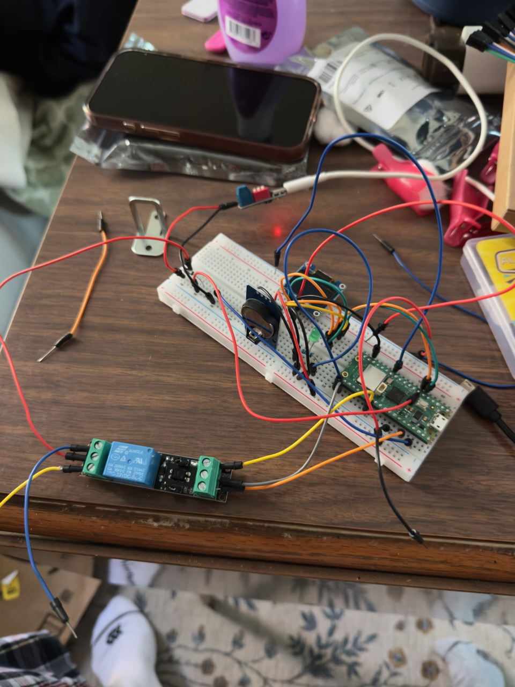
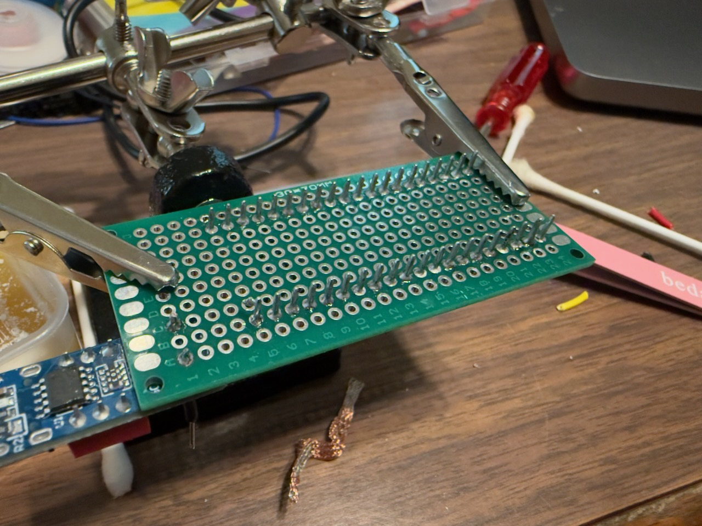
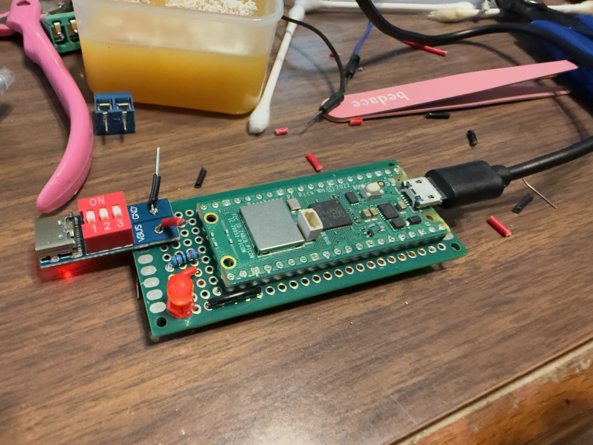
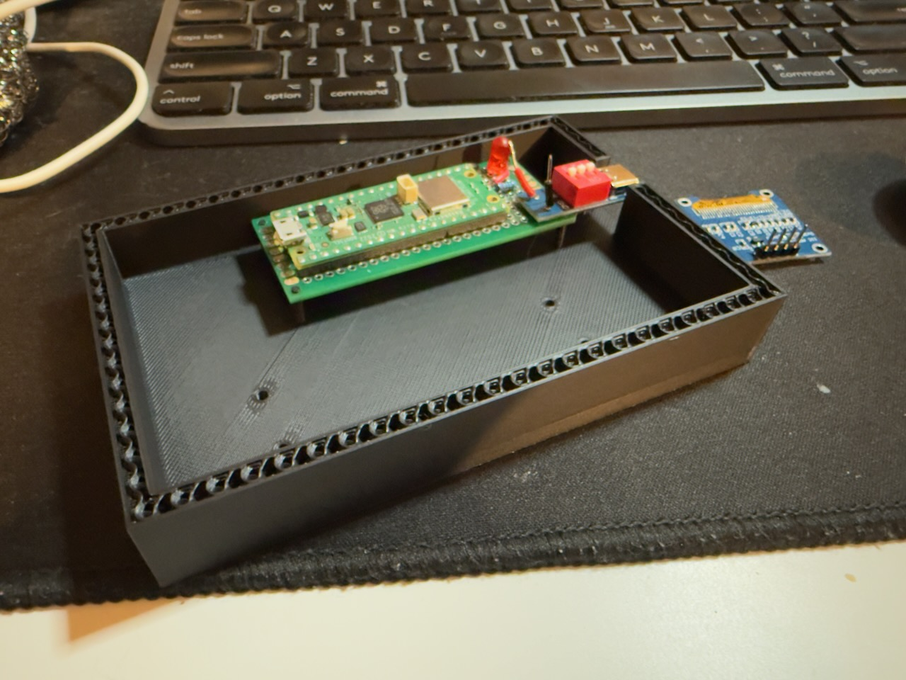

# Weekend-Only Lockbox — Project Plan (Summary)

## Goal
Build a small box that **only opens on weekends**. It uses:
- A **Raspberry Pi Pico** for logic
- A **DS3231 RTC** to keep the day/time
- A **128×64 I²C OLED (SSD1306)** to show status
- A **5 V cabinet latch/solenoid lock**
- A **3.3 V logic-compatible relay module** (optocoupled) to switch the lock’s 5 V power

---

## How it works (high-level)
1. Pico reads day/time from the **RTC**.
2. If it’s **Saturday or Sunday** (you define the open window), the Pico **energizes the relay**, powering the **5 V lock** to open.
3. OLED shows **status**: day/time and “Locked/Unlocked/Next open”.
4. Weekdays: relay stays off, lock remains closed.

---

## Parts (minimum viable)
- **Raspberry Pi Pico W+** 
- **DS3231 RTC module** (I²C, CR2032 coin cell installed)
- **OLED 0.96" 128×64 SSD1306** (I²C)
- **Relay module (3.3 V input)**, 1-channel, opto-isolated, low-trigger OK
- **Meccanixity 5 V cabinet lock / electric latch**
- **5 V 3 A DC power supply** (barrel jack or screw terminals)
- **1N4007 diode** for the lock (flyback protection)
- **USB-C Trigger Board Module 5V-20V**
- Wires, breadboard, productboard, small **inline fuse** (e.g., 1–2 A), enclosure

### Future Parts
- **Battery**

> Why 5 V / 3 A? Gives headroom for the lock’s inrush + relay + Pico. The Pico can also be powered from this same 5 V supply.

---

## Power plan
- **Single 5 V PSU** powers **everything**.
- **Pico power**: from 5 V via **USB** or **VSYS**.
- **Relay + lock**: directly from 5 V rail (separate path).
- **Common ground**: tie **GND (Pico)**, **GND (relay)**, and **GND (5 V PSU)** together.
- **Flyback diode** across the **lock** terminals (stripe/band to **+5 V**).

> The relay board’s diode protects the **relay coil**, not your **lock**—you still add the flyback diode across the lock.

---

## Simple wiring (I²C + Relay)
| Function        | Module                     | Pico Pin (example)                     | Notes                                                          |
| --------------- | -------------------------- | -------------------------------------- | -------------------------------------------------------------- |
| I²C SDA         | DS3231 + OLED (shared bus) | **GP4 (SDA)**                          | Both modules on same I²C bus                                   |
| I²C SCL         | DS3231 + OLED (shared bus) | **GP5 (SCL)**                          | Add 4.7 k pull-ups only if your boards don’t already have them |
| 3.3 V power     | DS3231 + OLED              | **3V3**                                | Check OLED VCC is 3.3–5 V tolerant (most are)                  |
| GND             | All modules                | **GND**                                | Common ground everywhere                                       |
| Relay IN        | Relay module               | **GP15** (any GPIO)                    | Many opto modules are **active-LOW** (IN=LOW → ON)             |
| Relay VCC/GND   | Relay module               | **5 V/GND**                            | Relay powers from 5 V rail                                     |
| Relay contacts  | Relay NO/COM → Lock +      | **NO→+5 V to lock**, **COM→+5 V rail** | When ON, lock gets +5 V via NO                                 |
| Lock – (return) | Lock negative              | **GND**                                | Return to PSU ground                                           |
| Flyback diode   | Across lock                | **Stripe to +5 V**                     | Protects relay & Pico                                          |

> Alternate contact wiring is fine (COM to +5 V rail, NO to lock +). Keep it consistent.

---

## Behavior window (choose one)
- **Simple**: Unlock **all day** Saturday & Sunday.
- **Windowed**: Unlock only **Sat 9:00–Sun 21:00**.
- **Timed pulse**: At allowed times, **pulse** the lock for e.g. **1–2 s** (some latches only need a momentary energize).

---

## Software outline (pseudo-flow)
1. Init I²C, RTC, OLED; set GPIO for relay (OUTPUT, default OFF).
2. Read RTC → day-of-week + time.
3. Decide `allowed = isWeekend(now)` (and within open window if you set one).
4. If `allowed`: set relay **ON** (remember if active-LOW), else **OFF**.
5. Update OLED: line1 time/date, line2 state (LOCKED/UNLOCKED), line3 next open time.
6. Sleep ~500 ms; loop.

> Libraries: SSD1306 driver + DS3231 RTC (Arduino-core for Pico or MicroPython). In Arduino, use **Earle Philhower Pico core**; in MicroPython, use `ssd1306.py` and simple DS3231 helpers.

---

## Milestones (bite-sized)
- [x] **Blink** an LED (prove toolchain).
- [x] **RTC read** time to serial.
- [x] **OLED** shows a “hello + time”.
- [x] **Relay click** with test sketch (no lock yet).
- [x] Add **flyback diode** and connect **lock**; test **momentary** energize.
- [ ] Implement **weekend logic**.
- [ ] **Enclosure** build: mount lock & strike plate; add **fuse**, strain relief.
- [ ] **Burn-in**: 24–48 h test with PSU.

---

## Gotchas / Safety
- **Diode across lock** is mandatory.
- Watch **relay trigger polarity** (active-LOW is common).
- Keep **5 V path** to lock **short & thick**; separate from signal wires.
- Secure PSU input with an **inline fuse** and **strain relief**.
- If the lock heats up, **use timed pulses** instead of continuous power.

---

## Stretch ideas
- **Manual override** button (inside) for emergency open.
- **Buzzer/LED** when open window starts.
- **Settings menu** on OLED (set open hours, show next open).
- **EEPROM/Flash** to store user settings.

---

## Bill of Materials (quick)
- RPi Pico, DS3231 module, 0.96" SSD1306 I²C OLED  
- 1-ch 3.3 V opto relay module (low-trigger OK)  
- 5 V cabinet lock  
- 5 V 3 A PSU + barrel jack breakout  
- 1N4007 (or 1N5817) diode, fuse holder + 1–2 A fuse  
- Wires, breadboard, enclosure & hardware

---

## Next actions
- [x] Order parts above (if not already).
- [x] Breadboard the **I²C + relay** without the lock; verify OLED/RTC.
- [x]Add **flyback diode**, connect lock, and test **1–2 s pulse**.
- Implement weekend logic; adjust unlock window to taste.
- Move into enclosure; add fuse and label wiring.

---

## Topics I should learn
- **Electronics fundamentals**
- **MicroControllers**
- **Embedded design**

# Notes
## Notes 2025-11-03

### What 
I have completed a lot from the past couple days
1. Worked out how to wire and test with a multimeter
2. I got the core functionality tested, meaning I was able to hook up my pico, relay, and 5v lock and unlock the lock from a program on the Pico.
3. I soldered the Pico, a led, a USB-C Trigger Board, to a prototype board and have it being powered by the usbc and blinking the led.

### Thoughts
My USB C is returning 5 volts and after the diode its about 4.75, I don't know if the 5v is "diluted" when being split between the relay and Pico. I'm wondering if I should increase the voltage and have 2 resistors making it 5v for the board and relay.

I am still considering adding a battery so the user can turn it on and off when its time to unlock

I am also dreading creating a 3d print to hold all of this

I was thinking of having multiple physical locks that can unlock the box in the case of an emergency, I think that would be fairly simple to do just have a "false top" that is held on top by 2 locks

### To-Do
- [x] Solder the relay to a protype board
- [x] Look into how to create a 3d print to house all of these components

---

## Notes 2025-11-10

Happy with my progress from yesterday. I didn't complete a lot so I will have to explain as to why I'm excited.

### What I did
- [x] Moved my GRD wire on my Pico's prof board to make some room for some header pins
	- I'm doing this so I can easily connect some io to the board like my relay, and OLED
- [x] Created a Test case for my Pico and it actually fit
	- I never created a 3d model before, I've attempted in the past but who knew designing parts that need to be precise to the mm would be hard.

It took be about 5 hours to just make a plastic bed which has 4 pillars to be inserted into the mount holes on my perf board. The exact design of my perf board was not available so I had to use my "measuring clamps" to get my dimensions and create a model to match.

I then used that model to design a mount to hold it, while doing this I knew that if mis-measured anything it wouldn't work but luckily that didn't seem to happen and I do say I'm pretty proud of my first go.

### Next Steps & Questions
- What is the purpose of the different types of capacitors
	- While researching it is recommended that I add capacitors so my electronics have consistent supply of energy. This makes sense because I did notice flickering for my LED / OLED screen when I did anything like press the button.
- How to safely add a battery, or should I even bother.
	- I really really want to add a battery but I don't want to bite off more than I can chew and it could be dangerous if I don't do it correctly.
	- I've been learning as I go and that usually works for me but I like my house undercooked so I may want to research before I mess with battery's. I was working on attempting to use another voltage setting on my Trigger Board and intake 9v instead of 5v so I wasn't splitting 5v => 5v & 5v, so I wanted to use a resistor to turn that 9v into 5v and the resistor started to smoke so I'm taking the power a bit more seriously.

## Notes 2025-11-11

### What I did
- [x] Adjust my 3d print to test thicker mounts
- [x] Adjusted a old 3D print to use on my pegboard

#### Test Pico Bedd
While I'm waiting for my transistors which should arrive today I had time to kill so I decided to practice my 3D modeling and adjust my test mount for my Pico and adjust a old 3d print for my pegboard.

The test mount was better, I increased the base by x1.5 and shortened the top bit which is what goes in the mount hole itself. It was a good thing too because while I was removing it from the previous test print it broke. So I tested if it would break on the new test and it didn't.

#### Peg-Board holder
The old pegboard print was funny to say the least. I was so focused on getting the hooks the correct distance apart that I didn't focus on the size of the bucket at all which lead to a very adorable little box.

This new one I increased the size of the hook and the bucket, made sure the distance of the hooks were right. This time I actually made it a little too big but that's fine. While i mounted it, one of the hooks cracked so I might look up the best print dimension for that type of stress. Also While I'm thinking about it I set the infill to 12% which is lower then I normally do it so maybe that has something to do with it cracking.

Autodesk is very confusing to me, especially its history aspect. The file that I created months ago was terrible, all of the sketches didn't make sense and didn't match the 3D body at all. When I tried to delete the sketches it would delete parts of the body that I assume were once created by that said sketch. When I work on it again Im going to export it as a model and import it for a fresh file with just the body.

